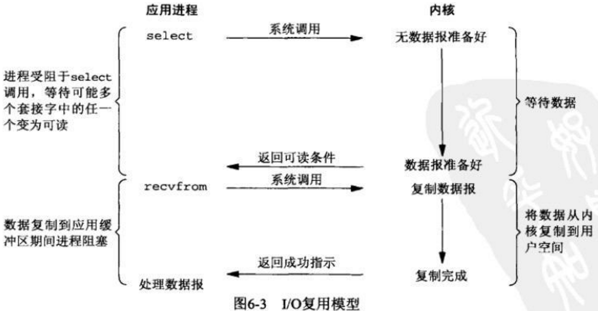

在详解Tornado的HTTP Server架构模型之前，先简单的聊聊web服务器的网络知识。首先了解一下，网络中的数据是怎么流动的。
<!-- more -->


用户请求数据给服务器的时候，与上图类似。其实网络数据和自来水管的水是一样的，哪里有道就朝哪里流。所以要让数据流动起来，当然是搭桥修路了。科技如此发达，搭桥修路的方法当然会各种各样。但是不管怎么样变，他们的目标就是搭桥修路，那么就有一些共同的特点。www上所谓的搭桥修路就是web server是比较重要的一种方式，下面看看web server。

tornado也是一个web server，那么必然要遵循web server的三部曲。

# web server的三部曲

 1. 服务器bind到一个端口，然后开始在该端口listen。
 2. 客户端connect到该端口，将请求发送给服务端。
 3. 服务端处理完响应的逻辑，数据write给client。
 


由上面的图就可以清楚地看到，**web服务器的三部曲，serverbind后就开始listen，接受client连接，client在发起连接后，server在接受到这个connect后，accept后建立与client一个socket连接，这样server端的client soceket就可以和client端的socketin进行通信了，包括接受数据，回写数据等。client发给server的request请求后，server接受到这个请求后把请求的内容转给处理这个请求的handler，handler按照相应逻辑处理后，把处理的数据通过socket连接回写给client，作为reponse，这样一个请求（client与server的交互）就完成了。若是短连接，则需要关闭连接；若是长连接，需要维护这个长连接，保持socket，使client与server的通道畅通无阻。**

上面是一个简单的处理一个请求的，那如果client有上千呢，上万呢，即连接有成千上万的时候，那问题就复杂多了，这样就会出现所谓的C10K问题。
## C10K问题
### C10K定义：
C10K问题是指当网络服务在处理成千上万的客户端连接的时候，往往出现效率底下甚至完全瘫痪。当然这是在互联网还没有普及的情况下是C10K，在web2.0时代，可能是C100K，C5000K等，但是意思和C10K是一样的。
### C10K的本质：
最早的时候服务器都是基于进程/线程模型来实现的，新来一个TCP链接，就需要分配一个进程/线程，但是进程/线程是操作系统最昂贵的，一台机器允许创建的进程数量有限的，况且进程在创建的比较多的时候，OS在调度、切换进程就需要耗费很多资源，效率低下。这种情况下，如果是C10K链接，那么就要创建1w的进程，那么OS根本是无法承受的，要继续服务，只能采用分布式，不断的加机器，但是加机器成本太大，一般公司的财力根本无法承受。这就是C10K问题出现的本质。

*实际上web1.0时代，也有异步模式，如select/poll等，但是这些技术都有一定的缺点，比如select最大不能超过1024，这是每个进程限制监听的最大打开的文件描述符数量；poll虽然没这个限制，可是每次接受到读写事件都需要遍历一次每个连接查看那个连接有数据请求，消耗较大。*

## C10K问题的一般选择的解决办法
**C10K问题解决一般使用Linux支持的epoll模型，epoll是异步非阻塞的，Nginx等都是epoll的产物.**

既然要聊C10K这类网络问题，那么肯定要了解一下基础的网络模型和一些基础概念，比如select/poll/epoll，异步、同步I/O、阻塞、非阻塞等，下面就来讨论上述概念。

# 异步、同步、阻塞、非阻塞
## 同步、异步
所谓的**同步、异步是基于消息通知机制角度，是针对应用程序与内核的交互**来说的。

 - **同步I/O**是应用程序发出一个功能调用后，死等结果，没有结果，该调用不会返回的；
 - **异步IO**是应用程序发出一个功能调用后，应用程序不会等待调用执行结果的，该调用该功能完成后，自己给应用程序通知去。
下面用一张图来说明：


举一个现实场景来说明上述图，比如我去银行去办理存钱业务，有两种方式去等待：

 - 排队等待
 - 选择抽取一个号码，等到开始办理这个号码的时候，工作人员会在喇叭喊我或者打电话给我，通知我轮到我办理业务。

其中前者就是同步等待消息通知，就是说一直在等待银行办理业务；后者就是等到银行通知，就是说异步等待消息通知，当事件发生后就触发回调机制去通知我。
**同步IO与异步IO的区别在于：应用程序调用是否会立即返回。**

## 阻塞、非阻塞
所谓**阻塞与非阻塞是从程序在等待消息通知（无所谓同步异步）时的状态**而言的，就是消息通知到的时候，如果调用的程序的数据还未准备好，此时时立即返回还是等待数据准备完成再返回。

 - **阻塞IO**是指执行这个函数的线程会在程序调用返回之前，一直挂起当前线程，该线程一直处于等待消息通知，不能够执行其他业务，直到函数在拿到调用结果后才返回，线程恢复执行。
 - **非阻塞IO**是指程序调用中函数不等结果，立即返回，该函数不会阻塞线程，线程不会挂起，线程继续执行其他的任务。

简单理解阻塞和非阻塞就是函数能不能立即返回，如果不能立即返回，需要等待，那么就是阻塞了；否则就是非阻塞了。


继续举例银行这个场景来说明上述问题，当你无论是排队等待办理业务，还是等待通知再去办理业务，等待期间，你有两种方式去消耗等待时间：

 - 一心一意等待，即一心一意的去排队，或者一心一意的等待叫你的号码，这期间除了等待消息之外，你什么都不能做，只是傻等。表现在程序中就是该函数调用之处不能继续朝下执行，阻塞了。
 - 等待的时候和老婆发微信聊天，刷朋友圈，直到排队到你办理业务，或者银行工作人员叫你号去办理业务。这就是说你没阻塞在等待排队到你或者等待叫你号这个消息通知上，你是在做自己的事，自己边玩边等。
 
上述两种方式其实就是阻塞与非阻塞的区别。前者显然是阻塞，除了等待，你什么都不能做，无论什么方式的等待都阻塞了；后者当然就是非阻塞了，你可以在等待期间，做自己的事情。看起来后者的效率高，你即完成了老婆交代办理银行业务的事情，又陪老婆聊天了，但是等待办理业务的是你，和老婆聊天的是你，你需要看看到你没，不断在低头和老婆聊天。在两种方式之间不断切换，一心不可二用，在切换频率过高，或者切换干的事情过多的时候，这个切换的消耗非常大，这个平衡点需要把握。

**阻塞和非阻塞的区别在于：数据拷贝的时候，进程是否阻塞！**

## 同步/异步-阻塞/非阻塞的组合解释
**阻塞调用和同步调用不是一回事，**不要混淆，对于同步调用来说，很多时候线程可能还是激活状态，并没有挂起，只是从逻辑上来说当时的函数还没有返回，但是此时线程可能也会处理别的事情。比如上述银行例子，同步调用只是在等待，但是这个等待调用可以是阻塞，也可以是非阻塞，也就是你可以一边等待一边刷微信和老婆聊天，也可以什么都不干一心一意的等到到你办理业务。

通过上面的同步/异步和阻塞/非阻塞的介绍，既然这四种形式是从不同的角度划分的，那么就可以分为**同步阻塞**，**同步非阻塞**，**异步阻塞**，**异步非阻塞**四种了。

 - **同步阻塞：**即消息通知是同步的，而且会等待数据返回，不仅通知到还要拿到数据结果再返回来。比如上面银行的例子，同步阻塞的意思就是你只能专心排队等待，什么事情都不能做的。
 - **异步阻塞：**采用异步的方式等待消息被触发，也就是说你在银行办业务的时候，拿到纸条后，只能呆呆的坐在大厅等候叫你，不能离开银行，或者不能刷朋友圈，你就被阻塞在这个事情上了，哪里也去不了了。**异步操作是可以被阻塞住的，只不过它不是在消息通知时阻塞，而是在等待消息通知这个事情上阻塞了。**
 - **同步非阻塞：**即消息通知是同步的，但是你可以不等待调用程序的数据准备好就返回。比如你一边在排队，一边在和老婆刷微信，只是你需要不断的在刷微信和抬头看你快排到了没这两种方式之间不停的来回切换。
 - **异步非阻塞：**消息通知到，而且不等待数据就直接返回了。比如你拿到号后，在大厅座位上等待的时候可以刷微信，或者你突然口渴想去超市买水，此时你告诉大堂经理，到你号的时候，打电话叫你一下（注册回调函数）。此时你并没有阻塞在银行办理业务这个事情上，这就是异步+非阻塞的方式，显然这种方式要高一些。程序也没有在两个不同的操作之间来回切换，因为给打电话是大堂经理的事情（消息触发机制），你只需要等待就好，触发了则通知你。

综上所述，同步/异步关注的是消息的通知机制，阻塞/非阻塞所关注的时候是程序（线程）等待消息通知期间的状态。

## 再次举例说明同步、异步、阻塞、非阻塞
上面已经明确说明，**同步/异步关注的是消息通知的机制，而阻塞/非阻塞关注的是程序（线程）等待消息通知时的状态。**，下面在举例一个场景，以小明下载文件为例，从这两个关注点来再次说明这两组概念。

 - 同步阻塞：小明一直盯着下载进度条，到 100% 的时候就完成。

> 同步体现在：等待下载完成通知；
> 阻塞体现在：等待下载完成通知过程中，不能做其他任务处理；

 - 同步非阻塞：小明提交下载任务后就去干别的，每过一段时间就去瞄一眼进度条，看到100% 就完成。 

> 同步体现在：等待下载完成通知；
> 非阻塞体现在：等待下载完成通知过程中，去干别的任务了，只是时不时会瞄一眼进度条；【小明必须要在两个任务间切换，关注下载进度】

 - 异步阻塞：小明换了个有下载完成通知功能的软件，下载完成就“叮”一声。不过小明仍然一直等待“叮”的声音。

> 异步体现在：下载完成“叮”一声通知； 
> 阻塞体现在：等待下载完成“叮”一声通知过程中，不能做其他任务处理；

 - 异步非阻塞：仍然是那个会“叮”一声的下载软件，小明提交下载任务后就去干别的，听到“叮”的一声就知道完成了。

> 异步体现在：下载完成“叮”一声通知；
> 非阻塞体现在：等待下载完成“叮”一声通知过程中，去干别的任务了，只需要接收“叮”声通知即可；【软件处理下载任务，小明处理其他任务，不需关注进度，只需接收软件“叮”声通知，即可】

**也就是说，同步/异步是“下载完成消息”通知的方式（机制），而阻塞/非阻塞则是在等待“下载完成消息”通知过程中的状态（能不能干其他任务）。**

# Linux下五种IO模型
网络IO的本质其实就是socket的读取，因为在Linux中socket被抽象成**流**，所以网络IO可以理解为对流的操作。
对于一次IO访问，数据先会被copy到os内核缓冲区，然后再从操作系统内核缓冲区copy到进程缓冲区。同理，对于sockt的IO而言，也要经历两步：

 - 等待网络上的数据分组到达，然后被复制到内核的某个缓冲区。
 - 把数据从内核缓冲区，复制到进程的缓冲区中。
 
**下面着重介绍Linux的五种常用的IO模型**：

 - 同步阻塞IO
 - 同步非阻塞IO
 - IO复用(select和poll、epoll)---其实也是同步的
 - 异步非阻塞IO
 - 信号驱动IO

其中前四种比较常用，尤其是IO复用，是现在网络编程的重点。下面重点介绍前四种。讲使用上面的银行柜台办理业务举例说明这几种模型。

## 同步阻塞IO

> 我在银行办理业务，人爆满，所以我不知道什么时候能轮到我办理业务，但是我又不能离开，我只能等待，等待轮到我办理，这等待期间我不能出去抽烟，更不能先回家女朋友，所有的事情都被办理业务这个事情阻塞着。这就是一个典型的同步阻塞IO。

同步阻塞IO是最常见的一种IO模型，也是最简单的一种模型，默认情况下都是同步阻塞IO模型。
**在这个IO模型中，用户空间的应用程序执行一个系统调用（recvform），这会导致应用程序阻塞，什么也干，直到数据准备好，并且将数据从内核复制到用户进程，最后进程再处理数据，在等待数据到处理数据的两个阶段，整个进程都被阻塞。不能处理别的网络IO。调用应用程序处于一种不再消费CPU而只是简单等待响应的状态。**
下图是在内核中等待数据和复制数据的大致网络模型图：


同步阻塞IO的特点就是在数据准备和数据拷贝的两个阶段都被block了。

## 同步非阻塞IO

> 我一直在银行傻等着办理业务，又不是阿甘能等到苹果公司的股票，况且旁边就是优衣库，我肯定不甘心这么浪费我的青春年华，所以我决定出去转转，看看能不能给老婆淘点宝回去。可是我的第一要务是办理银行业务，所以我不得不一会跑回来看看快到我没，一会又去优衣库，来回的切换，这就是典型的同步非阻塞IO，但是来来回回折腾，太累人了。
> 所以同步非阻塞就是 “每隔一会儿瞄一眼进度条” 的轮询（polling）方式。

由以上例子我们就可以看出：
**非阻塞IO也会进行recvform系统调用，检查数据是否准备好。只是非阻塞的recvform系统调用调用之后，进程并没有被阻塞，内核马上返回给进程，如果数据还没准备好，此时会返回一个error。进程在返回之后，可以干点别的事情，然后再发起recvform系统调用。重复上面的过程，循环往复的进行recvform系统调用。这个过程通常被称之为轮询。轮询检查内核数据，直到数据准备好，再拷贝数据到进程，进行数据处理。需要注意，拷贝数据整个过程，进程仍然是属于阻塞的状态。**

下图是同步阻塞IO在内核中等待数据和复制数据的大致网络模型图：


同步非阻塞IO的特点是用户进程需要不断的主动询问数据好了没有，需要轮询

## IO复用(select和poll、epoll)

> 此类型和同步阻塞差不多，银行在大堂装有大屏幕，这样我就不用每次回去问那个一脸我欠她几百万的样子的阿姨了，我直接看大屏幕就好了，但是还是要轮询去看。

IO复用就是同步非阻塞的2.0版，比如我不仅仅是办理银行业务，可能我还办理电话卡业务等，也就是说后台有多个任务在等待，我需要不断的在这好多个等待的进程中去切换，太累了，此时我老婆嫌我太累，来帮我看一半的业务，我来看一半，好了就通知我去办理，那么此时我老婆和我合起来就是所谓的**IO复用**，那么在Linux界，我老婆就相等于select、poll、epoll。

可以看出IO复用其实也是要轮询多个socket的，只不过使用select\poll\epoll来轮询的，而且可以同时对多个读操作，多个写操作的I/O函数进行检测，直到有数据可读或可写时（注意不是全部数据可读或可写），才真正调用I/O操作函数。

下图是同步阻塞IO在内核中等待数据和复制数据的大致网络模型图：



多路复用的特点是通过一种机制一个进程能同时等待IO文件描述符，内核监视这些文件描述符（套接字描述符），其中的任意一个进入读就绪状态，select， poll，epoll函数就可以返回。对于监视的方式，又可以分为 select， poll， epoll三种方式。

*IO多路复用在阻塞到select阶段时，用户进程是主动等待并调用select函数获取数据就绪状态消息，并且其进程状态为阻塞。所以，把IO多路复用归为同步阻塞模式。*

## 异步非阻塞IO

> 我在银行办理业务的时候，恰好碰见我一朋友，我朋友见我心不在焉，就说让我可以先回家，等到到我的时候，他给我打电话。于是我就吃着火锅唱着歌回家等待我朋友电话通知了。这就是异步非阻塞。

异步非阻塞IO中，无论内核数据是否准备好，都会直接返回给用户进程，然后用户态进程可以去做别的事情。等到socket数据准备好了，内核直接复制数据给进程，然后从内核向进程发送通知。IO两个阶段，进程都是非阻塞的。

下图是同步阻塞IO在内核中等待数据和复制数据的大致网络模型图：


上面这个看起来是很理想的情况，可是越理想，实现起来越麻烦，主要是操作系统实现API比较困难，有些os根本就不支持异步IO，而且异步 IO 的读写操作不会被缓存或缓冲，这就无法利用操作系统的缓存与缓冲机制。


## 五种IO类型的对比图


# select、poll、epoll

## epoll

### 流
要了解epoll等时间必须先了解流的概念。流在上面我们已经介绍过了，在Linux中，文件、socket、pipe等等可以进行IO操作的内核对象，都可以看做一个流。

### 缓冲区
再来了解一个概念，缓冲区：缓冲区的引入是为了减少频繁IO操作而引起的频繁的系统调用（很慢，很重），当你操作一个流的时候，更多的是以缓冲区为单位进行操作的，当然这是相对于用户而言的。对于内核而言，也有自己的缓冲区。所以缓冲区又分为用户缓冲区和内核缓冲区。
### 阻塞IO缺点
上面我们详细的介绍了阻塞与非阻塞，我们知道阻塞IO的典型缺点是，在此模式下，一个线程/进程只能处理一个流的IO事件，所以要处理很多的流的IO事件，唯有开多个线程或者进程，很显然这种办法很笨，而且效率不高，处理的流有限。
### 非阻塞IO
那么要处理高并发，就只剩下非阻塞IO了，既然是非阻塞的IO，那么就不是实时的，肯定就需要忙轮询，不断的去检查那个流可以进行读写了，一遍遍检查。
```python
while True {
    for i in starteam[];{
        if i has data:
            read until unavailable
    }
}
```
上述代码，我们看到我们需要不断的去轮询整个流，从而处理多流的情况。但是这样明显若是没有事件发生，就会白白浪费宝贵的CPU资源。为了避免无效的CPU轮询，就引入了一个代理，select代理，poll代理。
### select 、poll
 select、poll可以同时观察多个流的IO事件，他们本质上是一致的。在空闲的时候，会把当前线程阻塞掉，当有一个或多个流有I/O事件时，就从阻塞态中醒来，于是我们的程序就会轮询一遍所有的流（于是我们可以把“忙”字去掉了）
```python
while True {
    select/poll(streams[])
    for i in starteam[];{
        if i has data:
            read until unavailable
    }
}
```
此时没有IO事件发生的时候，程序就阻塞在select以外，但是这时候他的缺点也暴露出来了。当流发生IO事件后，却不知道是那个流可以读数据或者写数据了，我们只能**无差别的轮询**一遍所有的流，找出能读数据或者写数据的流，对他们进行操作。
**因此使用select的时候，我们又O(n)的无差别的轮询复杂度，显然同时处理的流越多，每一次轮询所花费的轮询时间越长。**
终于epoll大牛出现了。

### epoll介绍

**epoll可以理解为event poll，它不同于忙轮询和无差别的轮询，epoll会把那个流发生了什么样的IO事件通知我们，因此我们每次的对这些流的操作都是有意义的。复杂度瞬间降低到了O(k),K是发生的IO事件的流的个数，也有人认为是O(1)，显然效率和上述各种模型不在一个档次了，**男神啊简直是。
```python
while true {
    active_stream[] = epoll_wait(epollfd)
    for i in active_stream[] {
        read or write till unavailable
    }
}
```
即工作情形大致是：

 - epoll_create 创建一个epoll对象，一般epollfd = epoll_create() 
 - epoll_ctl（epoll_add/epoll_del的合体），往epoll对象中增加/删除某一个流的某一个事件。比如epoll_ctl(epollfd, EPOLL_CTL_ADD,socket,EPOLLIN);//有缓冲区内有数据时epoll_wait返回，epoll_ctl(epollfd, EPOLL_CTL_DEL,socket, EPOLLOUT);//缓冲区可写入时epoll_wait返回
 - epoll_wait(epollfd,...)等待直到注册的事件发生。


到此为止，本文就详细的聊了网络编程中一些基础概念，了解这些概念后，我们下一步就详细的剖析Tornado的源码，和高手过招，一定很刺激。

学Python，我们是认真的。
 
[比较好的讲解的博客推荐](http://blog.jobbole.com/99905/)
