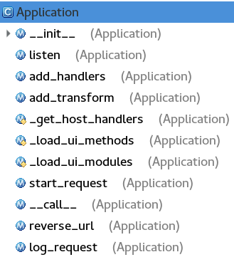

torndao.web是Handler类的集合，tornado的web框架是在web.py中实现的，tornado.web模块中提供了两个重量级的类，Application和RequestHandler（本质是http请求处理的封装）类。Application类主要是做路由转发，torndao使用web.Application做URI，然后在通过RequestHandler类去处理这些请求。

<!-- more -->
# torndao.web.Application
Application官网解释说它是一系列网络请求的Handler，这些Handler的组合撑起了一个web网站。

torndao.web.Application提供的函数：


## Application类的方法和工作原理简单介绍

 - 构造函数：接受handlers参数，也是最终匹配主机的路径路由列表；设定transform列表；设定静态文件的路由；添加(".*$")的路由列表。
 - listen方法：创建server，并把自身，self作为回调函数
 - accept到新连接后主动调（__call__），其根据请求，把该请求转发到相应的路由路径表中具体的handler上去处理请求

## **def __init__()**
```python
def __init__(self, handlers=None, default_host="", transforms=None,
        **settings):
```
参数解析：

 - **handlers：**类型为list，一系列的URI的处理器列表，为对应的每个URI与handlers处理器的map，类似[(URI,handler_1),(URI_01,handler_1),.....]，当然还可以带一系列参数，比如static_path等:
```python
application = web.Application([
(r"/static/(.*)", web.StaticFileHandler, {"path": "/var/www"}),
])
```
 - **default_host:**
 - **transforms：**分块、压缩等
 - **settings：**各种设置，如static、gzip、cookie_secret等等，是一个dict


Application类的初始化函数，将传入的处理器列表调用add_handlers函数注册，再有一些分块、压缩、UI、静态文件处理器的初始化，并调用add_handlers 方法，完成URI和处理器的映射关系，这个函数我们下面将会详细的介绍这个函数。

## **def listen()**
```python
def listen(self, port, address="", **kwargs):
```
这个函数只是对HTTPServer的listen函数的一个封装，返回一个HTTPServer实例。在HTTPServer类中将仔细分析该函数。


### 源码
```python
def listen(self, port, address="", **kwargs):
    from tornado.httpserver import HTTPServer
    #简单的封装
    server = HTTPServer(self, **kwargs) #当连接到来后，HTTPServer负责调用
    server.listen(port, address)
    return server
```
**这里我们可以认为，在特定的地址-端口上创建并监听socket，并注册socket的可读事件到自身的call（前后双下划线，下同）方法上，即每逢一个新连接到来后，call将被调用。**

## **def add_handlers()**
```python
def add_handlers(self, host_pattern, host_handlers)
```
参数解析：

 - **host_pattern：**主机名正则
 - **host_handlers:**路由表和handler，即路径路由列表。如：
```python
application = web.Application([
    (r"/static/(.*)", web.StaticFileHandler, {"path": "/var/www"}),
])
```
添加路由与handlers的到处理器列表中，完成URI和处理器的映射。

### 源码

```python
def add_handlers(self, host_pattern, host_handlers):
    #若无正则表达式的结束符，则添加
    if not host_pattern.endswith("$"):
        host_pattern += "$"
    handlers = []

    #self.handlesr是一个主机和路由列表，每个元素是一个tuple，
    #将主机名和路径路由列表合成tuple，添加到self.handlers中，供_get_host_handler()检索，
    #可以根据主机名找到路径路由列表
    if self.handlers and self.handlers[-1][0].pattern == '.*$': #由于'.*$'的特殊性，必须放在列表的最后
        self.handlers.insert(-1, (re.compile(host_pattern), handlers))
    else:
        self.handlers.append((re.compile(host_pattern), handlers))

    for spec in host_handlers:
        if isinstance(spec, (tuple, list)):
            assert len(spec) in (2, 3, 4)
            spec = URLSpec(*spec)
        #添加到处理器列表中
        handlers.append(spec)
        if spec.name:
            if spec.name in self.named_handlers:
                app_log.warning(
                    "Multiple handlers named %s; replacing previous value",
                    spec.name)
            self.named_handlers[spec.name] = spec
```
我们看这个函数函数还是很简单的，就是把URI和handler添加到处理器列表中，完成映射map，完事。

## **def add_transform()**
```python
def add_transform(self, transform_class):
```

这个函数及其简单，完成的任务就是添加输出过滤器，例如gzip，chunk，会在输出的时候调用其。

## def __call__()(备注：前后双下划线，下同)

这个函数可以说是Application的主要核心方法之一，我们详细的来看看。

```python
    def __call__(self, request):
        #传统的HTTP服务器接口
        dispatcher = _RequestDispatcher(self, None)#传进去的是self参数
        dispatcher.set_request(request)
        return dispatcher.execute()
```
参数解析：

 - **request:**HttpRequest对象对象，定义在httputil中。

这个函数实现的挺有技巧性，实现了一个__call__函数，这个函数有什么作用呢，就是类Application可以当做函数来调用了。
Application类可以这么理解它自身的一些函数的关系：
在特定的地址-端口上创建并监听该socket，并且注册了该sockt的可读事件到自身的__call__函数。

**__call__函数的好处**

 - Application类的对象可以当做函数来调用。
 - 当类对象当做函数来调用的时候，__call__会自动被调用，并且会保留对象的上下文。

我们在tornado版的hello world前面的举例中，会发现当时是这么调用的：
```python
application = tornado.web.Application([
    (r"/", MainHandler),
])
http_server = tornado.httpserver.HTTPServer(application)
http_server.listen(options.port)
tornado.ioloop.IOLoop.current().start()
```

上述举例可以看出，**我们将Application实例传给了HTTPServer，当监听到（listen()函数）请求的，由于Application类实现了__call__函数,所以当请求到来后，通过HTTPServer来调用Application实例，__call__方法中完成具体的URI转发工作，即，__call__函数会遍历Application的handlers列表，匹配到相应的URL的handler后，通过handler._execute进行相应处理；如果没有匹配的URL，则会调用ErrorHandler。**

由上面的__call__函数我们看到，此方法主要是调用_RequestDispatcher来完成请求的处理，那么下面我们具体看看请求到来后的处理过程：

### **Application对request的处理过程**
```python
def _has_stream_request_body(cls):
    if not issubclass(cls, RequestHandler):
        raise TypeError("expected subclass of RequestHandler, got %r", cls)
    return getattr(cls, '_stream_request_body', False)

#Application类的方法
#Application类的构造函数有这么一段代码：
"""
if handlers:
    self.add_handlers(".*$", handlers)#host_pattern传入".*$",表示无限次的匹配，即默认情况下，所有的主机名都会被匹配
"""
#所以显然，默认情况下，任何host都会被匹配的，
def _get_host_handlers(self, request):
    host = split_host_and_port(request.host.lower())[0]
    matches = []
    for pattern, handlers in self.handlers:
        if pattern.match(host):
            matches.extend(handlers)
    if not matches and "X-Real-Ip" not in request.headers:
        for pattern, handlers in self.handlers:
            if pattern.match(self.default_host):
                matches.extend(handlers)
    return matches or None

class _RequestDispatcher(httputil.HTTPMessageDelegate):
    def __init__(self, application, connection):
        self.application = application
        self.connection = connection
        self.request = None
        self.chunks = []
        self.handler_class = None
        self.handler_kwargs = None
        self.path_args = []
        self.path_kwargs = {}

    .....

    def set_request(self, request):
        self.request = request
        self._find_handler()
        self.stream_request_body = _has_stream_request_body(self.handler_class)

    def _find_handler(self):
        app = self.application
        #该函数将得到该host对应的路径路由列表，也就是那个映射map，
        #也就是说返回的列表就是传递给构造Application的那个tuple列表
        handlers = app._get_host_handlers(self.request)
        if not handlers:
            self.handler_class = RedirectHandler
            self.handler_kwargs = dict(url="%s://%s/"
                                       % (self.request.protocol,
                                          app.default_host))
            return
        #handler得到类似：[URLSpec('/$', <class '__main__.IndexHandler'>, kwargs={}, name=None), URLSpec('/poem$', <class '__main__.PoemPageHandler'>, kwargs={}, name=None)]的返回值，就是对应的路径路由列表
        for spec in handlers:
            #对于路由表中的每个对象用request.path匹配，根据请求URL路径匹配Handler
            match = spec.regex.match(self.request.path)
            #匹配到路径后，生成RequstHandler对象，取得URL路径参数，跳出循环
            if match:
                #实例化，生成RequstHandler对象，即调用此类的构造函数
                self.handler_class = spec.handler_class
                self.handler_kwargs = spec.kwargs
                #根据path路径，得到请求的URL的参数
                if spec.regex.groups:
                    #字符串做key的正则表
                    if spec.regex.groupindex:
                        self.path_kwargs = dict(
                            (str(k), _unquote_or_none(v))
                            for (k, v) in match.groupdict().items())
                    else:
                        #数字做key正则表
                        self.path_args = [_unquote_or_none(s)
                                          for s in match.groups()]
                return
        #若没匹配的到，如果有默认的handler，则使用
        if app.settings.get('default_handler_class'):
            self.handler_class = app.settings['default_handler_class']
            self.handler_kwargs = app.settings.get(
                'default_handler_args', {})
        #否则返回404
        else:
            self.handler_class = ErrorHandler
            self.handler_kwargs = dict(status_code=404)

    def execute(self):
        if not self.application.settings.get("compiled_template_cache", True):
            with RequestHandler._template_loader_lock:
                for loader in RequestHandler._template_loaders.values():
                    loader.reset()
        if not self.application.settings.get('static_hash_cache', True):
            StaticFileHandler.reset()

        self.handler = self.handler_class(self.application, self.request,
                                          **self.handler_kwargs)
        transforms = [t(self.request) for t in self.application.transforms]

        if self.stream_request_body:
            self.handler._prepared_future = Future()

        #调用已注册的处理器的_execute方法，处理请求。
        self.handler._execute(transforms, *self.path_args,
                              **self.path_kwargs)
        return self.handler._prepared_future
```

# torndao.web.RequestHandler

RequestHandler就是具体处理请求的类。这个类非常重要，RequestHandler中涉及到很多HTTP相关的技术，包括 Header、Status、Cookie、Etag、Content-Type、链接参数、重定向、长连接等等，还有和用户身份相关的XSRF和CSRF等等。

在上面介绍Application中可以看到，Application通过调用RequestHandler类的方法_execute来完成调度，那么_execute显然就是真正干活的地方，我们就重点看这个函数。这个类中还包含了很多很实用的方法，具体在应用的时候可以看看。

## _execute方法

### 函数原型：
```python
def _execute(self, transforms, *args, **kwargs):
```

参数解析：

 - **transforms:**相当于Application的中间件
 -

```python
@gen.coroutine
def _execute(self, transforms, *args, **kwargs):
    self._transforms = transforms
    try:
        if self.request.method not in self.SUPPORTED_METHODS:
            raise HTTPError(405)
        self.path_args = [self.decode_argument(arg) for arg in args]
        self.path_kwargs = dict((k, self.decode_argument(v, name=k))
                                for (k, v) in kwargs.items())
        if self.request.method not in ("GET", "HEAD", "OPTIONS") and \
                self.application.settings.get("xsrf_cookies"):
            self.check_xsrf_cookie()

        result = self.prepare()
        if result is not None:
            result = yield result
        if self._prepared_future is not None:
            self._prepared_future.set_result(None)
        if self._finished:
            return

        if _has_stream_request_body(self.__class__):
            try:
                yield self.request.body
            except iostream.StreamClosedError:
                return

        #调handler的具体业务逻辑处理，在子类的get/post/put/delete 方法中处理，这里就是真正调Handler的post、get等方法的地方
        method = getattr(self, self.request.method.lower())
        result = method(*self.path_args, **self.path_kwargs)
        if result is not None:
            result = yield result
        #self.finish函数做一些善后事宜，比如释放缓冲区，关闭连接等
        if self._auto_finish and not self._finished:
            self.finish()
    except Exception as e:
        try:
            self._handle_request_exception(e)
        except Exception:
            app_log.error("Exception in exception handler", exc_info=True)
        if (self._prepared_future is not None and
                not self._prepared_future.done()):
            self._prepared_future.set_result(None)
```

