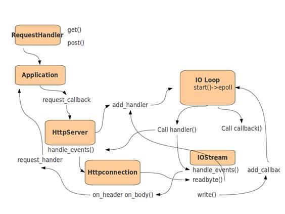
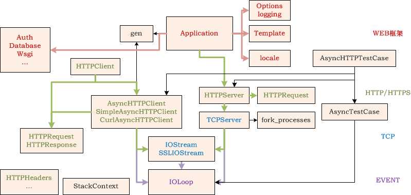
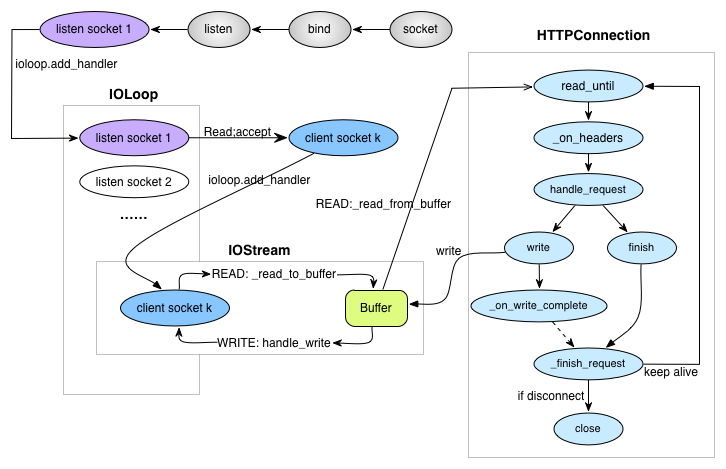

聊torndao源码前，先看看torndao框架的整体设计模型。在俯瞰Torndao的设计框架前，我们聊了web server的基本只是，handler的了解等，我们知道torndao是web framework，因为tornado把重复性的工作提炼出来，比如非常高效的Handler机制，比如鼎鼎大名的IOLoop，用起来非常方便，舒适，它把重复“造轮子”的工作给提炼出来了。torndao已经把一个http server的各个流程已经搭建好了，你只需呀按照你的需求去装修这个房子就成了，基础设施torndao会帮你干。

<!-- more -->

那么既然torndao是一个web framework，肯定是会遵循web server的三部曲，我们在前面文章的hello world中见到了lister，但是并没有看到最主要的appect、send、rev等常见的流程，为什么呢？
如果你记忆力很好，你肯定记得hello world中有这么一句话：
```python
tornado.ioloop.IOLoop.instance().start()
```
原来tornado把accept、rev、send等都封装在IOLoop中，因为其实大伙写accept都大同小异，写一个死循环，不断的appect客户端的请求，用rev、send来处理。既然都大同小异，torndao就干脆把这些封装在IOLoop中了，你只要启动IOLOOP，那么他自动会帮你干这些事情，你只需要安心写你的Handler就行了。

# torndao响应请求

我们在浏览器中输入：http://127.0.0.1:8888，浏览器会连接到我们的服务器，把HTTP请求转发到HTTPServer中，HTTPServer会先parse request，然后把request交给第一个匹配的Handler。Handler负责组织数据，调用发送API把数据发给客户端，收工！


# torndao解决C10K问题的模型：

对于C10K问题，torndao采用的是多进程 + 非阻塞 + epoll模型来解决的，下面是torndao的网络模型相关的：



# Tornado框架设计模型



# Tornado的HTTP服务器的工作流程



由上图看到，服务器的工作流程：
**首先按照socket->bind->listen顺序创建listen socket监听客户端，并将每个listen socket的fd注册到IOLoop的单例实例中；当listen socket可读时回调_handle_events处理客户端请求；在与客户端通信的过程中使用IOStream封装了读、写缓冲区，实现与客户端的异步读写。**
